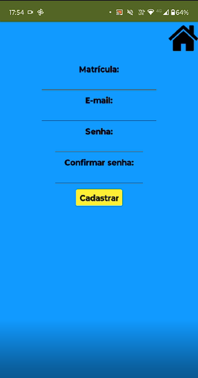
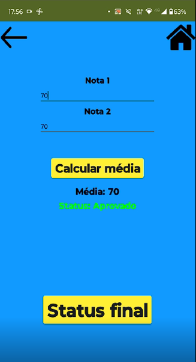

# Aplicativo

## Introdução

O aplicativo foi desenvolvido através do software MIT App Inventor, apresentando suas funcionalidades essenciais e básicas. Atualmente, encontra-se na versão 06.24B.

## Demonstração do App

## Acesso ao Aplicativo

[Baixe o app clicando AQUI!](./apk/app_notasv06.24B.apk){:download="FEPI Notas"}

## Screenshots

