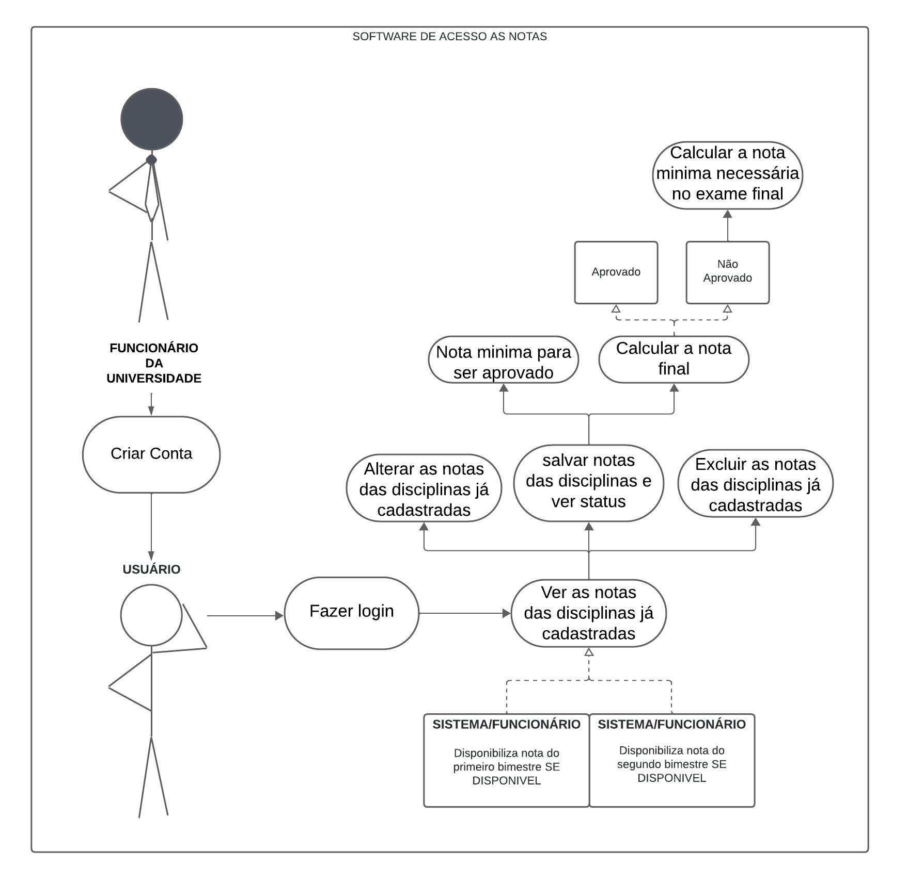
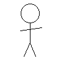
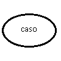
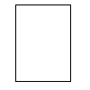
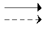
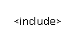
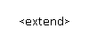

# Casos de Uso

## Introdução

Os diagramas de casos de uso são um técnica de modelagem utilizada principalmente na engenharia de 
software para descrever as interações entre um sistema e seus usuários ou outros sistemas, coletando, analisando e especificando suas funções (funcionais ou não).
Fazem parte da UML (Unified Modelling Language), uma linguagem que define uma série de artefatos e diagramas que nos ajudam na tarefa de modelar e documentar os sistemas orientados a objetos que desenvolvemos.

## Metodologia

Como explicado anteriormente, o artefato utilizado foi o diagrama de casos de uso, integrante da UML. Utilizamos a abordagem padrão para sua criação, composta pelos atores, que representam os usuários e os casos de uso, que representam os requisitos funcionais da aplicação, ou seja, descrevem as ações e interações que o usuário pode realizar dentro do sistema. O software de modelagem utilizado foi o LucidChart. 

## Diagrama de Casos de Uso - UML

## Glossário

*Tabela 1: Legenda do Diagrama de Casos de Uso*

| Nome | Função | Elemento
| ---- | ---- | ---- |
| Ator | Bonecos palito que representam os usuários do sistema. |  |
| Caso de Uso | Representa uma funcionalidade do sistema. |  |
| Sistema | Forma retangular usada para representar o sistema ou uma porção dele. |  |
| Relações | São usadas para representar as interações entre os usuários e os casos de uso (funcionalidades). |  |
| Inclusão | Tipo de relação que inclui um caso em outro, tornando a realização da funcionalidade inclusa obrigatória. |  |
| Extensão | Tipo de relação que transforma um caso como extensão de outro, contudo, essa relação não torna sua realização obrigatória. | 

## Especificação dos Casos

Nessa seção estão declaradas as especificações dos casos de uso (tabela 2 a 9).

### Requisitos Funcionais

*Tabela 2: Calcular a nota mínima necessária para ser aprovado*

| UC 01 | Calcular a nota mínima necessária para ser aprovado |
| ---- | ---- |
| **Descrição** | O usuário deve ser capaz de calcular a nota mínima necessária para ser aprovado no bimestre. |
| **Ator** | Aluno Usuário |
| **Prioridade** | Essencial |
| **Pré-condições** | Estar logado; Acesso à internet; Acesso ao app |
| **Fluxo Principal** | X |
| **Pós-condições** | Nota mínima para ser aprovado no bimestre |

*Tabela 3: Calcular a nota final com as notas do 1° e 2° bimestre*

| UC 02 | Calcular a nota final com as notas do 1° e 2° bimestre |
| ---- | ---- |
| **Descrição** | O usuário deve ser capaz de calcular a nota final para saber se ficou de exame final ou não. |
| **Ator** | Aluno Usuário |
| **Prioridade** | Essencial |
| **Pré-condições** | Estar logado; Acesso à internet; Acesso ao app; Notas do 1° e 2° bimestre estarem lançadas |
| **Fluxo Principal** | X |
| **Pós-condições** | Nota final do período |

*Tabela 4: Calcular a nota mínima necessária para ser aprovado caso o aluno tenha ficado de exame final*

| UC 03 | Calcular a nota mínima necessária para ser aprovado caso o aluno tenha ficado de exame final |
| ---- | ---- |
| **Descrição** | O usuário deve ser capaz de calcular a nota mínima necessária para ser aprovado no período caso tenha ficado de exame final. |
| **Ator** | Aluno Usuário |
| **Prioridade** | Essencial |
| **Pré-condições** | Estar logado; Acesso à internet; Acesso ao app; Notas do 1° e 2° bimestre estarem lançadas; Nota final estar lançada |
| **Fluxo Principal** | X |
| **Pós-condições** | Nota mínima para ser aprovado no período |

*Tabela 5: Salvar as notas de cada disciplina*

| UC 04 | Salvar as notas de cada disciplina |
| ---- | ---- |
| **Descrição** | O usuário deve ser capaz de salvar as notas de cada disciplina para eventuais consultas conforme são lançadas. |
| **Ator** | Aluno Usuário |
| **Prioridade** | Média |
| **Pré-condições** | Estar logado; Acesso à internet; Acesso ao app; Notas individuais de cada disciplina |
| **Fluxo Principal** | X |
| **Pós-condições** | Notas estarem salvas e de fácil acesso |

*Tabela 6: Ver o status das disciplinas (cursando, aprovado, reprovado, ficou exame final)*

| UC 05 | Ver o status das disciplinas |
| ---- | ---- |
| **Descrição** | O usuário deve ser capaz de visualizar o seu estado atual em cada disciplina. |
| **Ator** | Aluno Usuário |
| **Prioridade** | Baixa |
| **Pré-condições** | Estar logado; Acesso à internet; Acesso ao app; |
| **Fluxo Principal** | X |
| **Pós-condições** | Estar ciente de seu estado atual |

*Tabela 7: Ver notas das disciplinas já cadastradas*

| UC 06 | Ver notas das disciplinas já cadastradas |
| ---- | ---- |
| **Descrição** | O usuário deve ser capaz de visualizar as notas já lançadas no sistema. |
| **Ator** | Aluno Usuário |
| **Prioridade** | Essencial |
| **Pré-condições** | Estar logado; Acesso à internet; Acesso ao app; Nota estar registrada no sistema |
| **Fluxo Principal** | X |
| **Pós-condições** | Estar ciente de sua nota |

*Tabela 8: Alterar notas já cadastradas*

| UC 07 | Alterar notas já cadastradas |
| ---- | ---- |
| **Descrição** | O usuário deve ser capaz de alterar as notas já cadastradas, caso haja algum erro, problema ou necessidade de mudança. |
| **Ator** | Funcionário da Universidade |
| **Prioridade** | Baixa |
| **Pré-condições** | Estar logado; Acesso à internet; Acesso ao app; Nota estar cadastrada |
| **Fluxo Principal** | X |
| **Pós-condições** | Nota ser alterada conforme a necessidade |

*Tabela 9: Excluir uma disciplina cadastrada*

| UC 08 | Excluir uma disciplina cadastrada |
| ---- | ---- |
| **Descrição** | O usuário deve ser capaz de excluir uma disciplina cadastrada no sistema. |
| **Ator** | Funcionário da Universidade |
| **Prioridade** | Baixa |
| **Pré-condições** | Estar logado; Acesso à internet; Acesso ao app; Disciplina estar cadastrada no sistema |
| **Fluxo Principal** | X |
| **Pós-condições** | Disciplina ser excluída dos registros |

## Especificação Suplementar

Nessa seção estão declaradas as especificações complementares do sistema, requisitos que se encontram dentre
usabilidade, confiabilidade, desempenho e suportabilidade.

### Requisitos Não Funcionais

#### Usabilidade

*Tabela 10: Requisitos de Usabilidade*

| ID | Descrição |
| ---- | ---- |
| `ES01` | O design deve ser claro e eficiente, de forma que o usuário consiga navegar pelo sistema facilmente. |
| `ES02` | O aplicativo deve ser acessível para usuários com deficiências. |

#### Confiabilidade

*Tabela 11: Requisitos de Confiabilidade*

| ID | Descrição |
| ---- | ---- |
| `ES03` | O usuário deve ter a possibilidade de alterar suas informações pessoais. |
| `ES04` | O aplicativo deve tratar os dados do usuário com responsabilidade. |
| `ES05` | Realizar backups regulares para evitar a perca significativa de dados. |
| `ES06` | Fornecer procedimentos de recuperação de conta. |

#### Desempenho

*Tabela 12: Requisitos de Desempenho*

| ID | Descrição |
| ---- | ---- |
| `ES07` | O aplicativo deve fornecer os cálculos de forma rápida e eficiente; preferencialmente inferior a 3 segundos. |
| `ES08` | O aplicativo deve ser capaz de  lidar  com o significativo aumento de tráfego simultâneo. |

#### Suportabilidade

*Tabela 13: Requisitos de Suportabilidade*

| ID | Descrição |
| ---- | ---- |
| `ES09` | O aplicativo deve ser compátivel com sistemas operacionais inferiores, de forma que consigam migrar para as novas sem dificuldade. |
| `ES10` | Deve possuir padrões de segurança reconhecidos, como o ISO 27001. |
| `ES11` | O aplicativo deve possuir apoio e suporte a problemas e dúvidas que possam ocorrer ao usuário. |