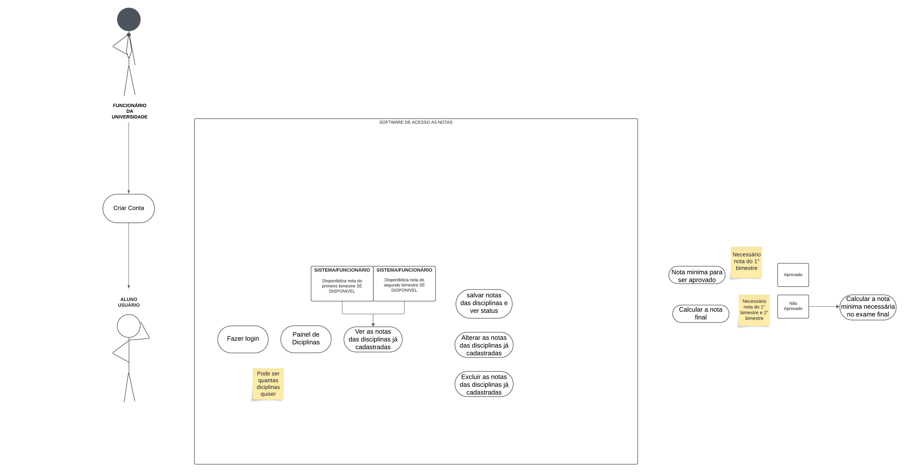
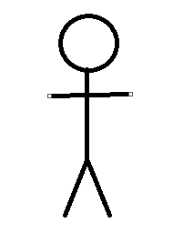

# Casos de Uso

## Introdução

Os diagramas de casos de uso são um técnica de modelagem utilizada principalmente na engenharia de 
software para descrever as interações entre um sistema e seus usuários ou outros sistemas, coletando, analisando e especificando suas funções (funcionais ou não).
Fazem parte da UML (Unified Modelling Language), uma linguagem que define uma série de artefatos e diagramas que nos ajudam na tarefa de modelar e documentar os sistemas orientados a objetos que desenvolvemos.

## Metodologia

Como explicado anteriormente, o artefato utilizado foi o diagrama de casos de uso, integrante da UML. Utilizamos a abordagem padrão para sua criação, composta pelos atores, que representam os usuários e os casos de uso, que representam os requisitos funcionais da aplicação, ou seja, descrevem as ações e interações que o usuário pode realizar dentro do sistema. O software de modelagem utilizado foi o LucidChart. 

## Diagrama de Casos de Uso - UML

## Glossário

| Nome | Função | Elemento
| ---- | ---- | ---- |
| Ator | Bonecos palito que representam os usuários dos sistema. |  |

## Especificação Suplementar

### Requisitos Funcionais

### Requisitos Não Funcionais