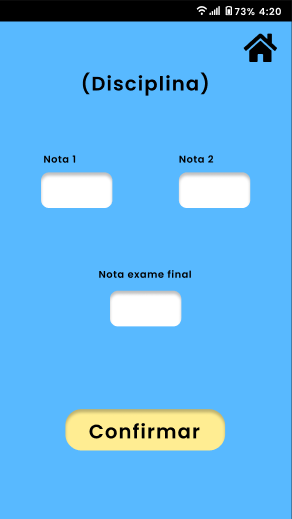

# Protótipo

## Introdução

O molde do projeto foi produzido através do web software "Figma",
sendo este uma plataforma colaborativa para construção de design de interfaces e protótipos, onde uma equipe pode trabalhar simultaneamente
e compartilhadamente em uma arquitetura de prototipagem.

## Acesso ao Projeto

[Confira o protótipo clicando aqui.](https://www.figma.com/proto/7FlCRGlrXPJ8iF4eoBvFVC/Interface?node-id=10-213&mode=design&t=SQmobYMtsOu4veR4-1)

# Screenshots

